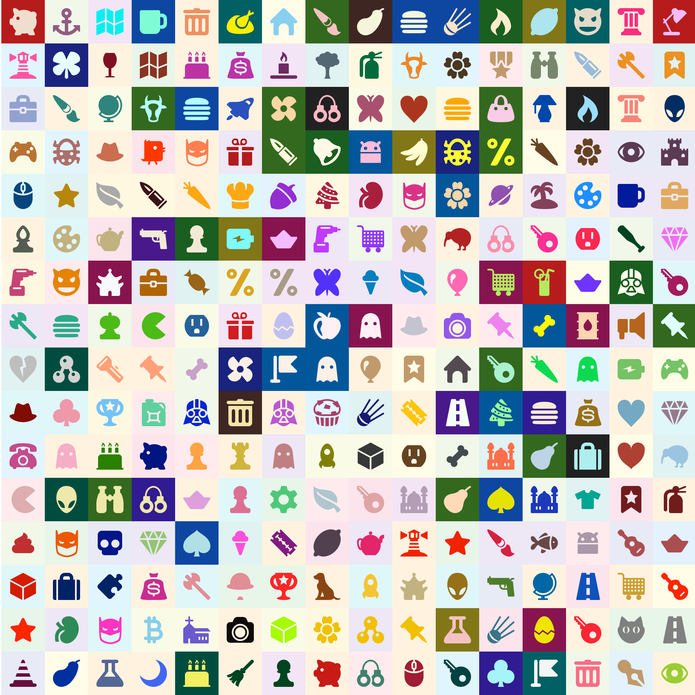

# avatartools
A couple of small utilities to generate random avatars for users of incognito groups. 

## generateavatars
Simple utility to generate avatars of different shapes and colors from prepared blueprints. The result of the program generates 128*128px avatars like these:

Prerequisites:

- ___images___ folder must exist and contain template 128x128 images in .png format. While there are no restrictions on image contents, best results are achieved with black-on-transparent template images. _No non-images files are allowed in this folder, the program currently does not retry image generation if randomly chosen file turns out to be a non-image_
- ___colors.json___ file must contain JSON with a list of available colors. 

The program 

Usage: 

> $ python generateavatar.py folder

Where _folder_ is a folder to store the output file. 

## mergeavatars
Simple utility to merge two different avatars, for use in two-person private chats. The result of the program generates 128*128px avatars like these:

Usage: 

> $ python mergeavatars.py firstavatar secondavatar folder

Where _firstavatar_ and _secondavatar_ are original avatar images, and _folder_ is a folder to store output file. URLs are accepted as file parameters. 

---

## License

- **[GNU AGPL 3.0 license](https://www.gnu.org/licenses/agpl-3.0.html)**
- Copyright 2020 © <a href="http://redsolution.com" target="_blank">redsolution OÜ</a>.
